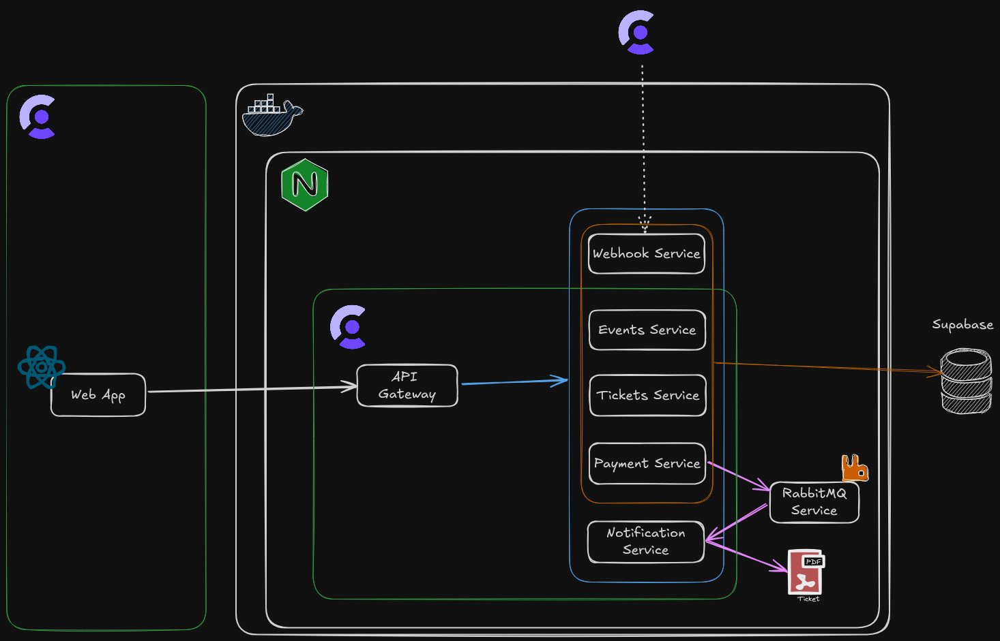

# React Ticket System

This is a small project to learn a few things

- React
  - No frameworks on top of it (NextJS, Remix, etc)
- React Router
- TanStack Query
- Supabase
  - For database
- Clerk
  - For user and session management
- RabbitMQ
  - The idea behind RabbitMQ was to decouple the ticket generation from payment service.
    Since purchasing a ticket doesn't depend on generating the ticket (pdf) and it shouldn't block the process until it was generated, I decided to try decoupling it.
- Microservice architecture
  - This is obviously just a small microservice architecture, nothing enterprise-level. Like I said it just to learn a few things about it.
- Docker
  - To control the start and building of the services.

**Command to start the web app**

> npm run dev

**Command to start services**

> docker compose up -d --build

**Command to start ngrox**

> ngrok http --url=\<ENDPOINT\>.ngrok-free.app 3000

ngrok was needed since the application saves in the database the Clerk's user id when registers for the first time.
With this ID Supabase checks the RLS (Row Level Security) permissions for the user to select, insert, delete, etc.
So when the user registers Clerk posts to the endpoint **\<ENDPOINT\>/api/webhooks**, and to be able to capture
that post in development I needed ngrox (suggested by Clerk) to redirect it to my localhost environment.

---

**Diagram**

Not the best diagrama out there but still works

---

All the images come from different places. There are 20 for 3 possible sizes each, for the responsiveness, but still the original ones may be quite heavy.

- https://www.freepik.com/free-photos-vectors/concert
- https://wallpaperaccess.com/4k-concert
- https://pxhere.com/en/photo/912966
- https://wallpapercave.com/w/wp4035877

---

I don't have planned to improve, fix and extend this project. A few things were left midwork and they will stay like that. It served its purpose. Hopefully it helps somebody else out there.
